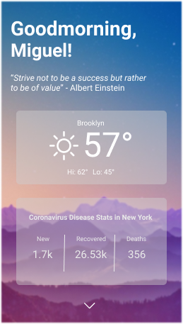
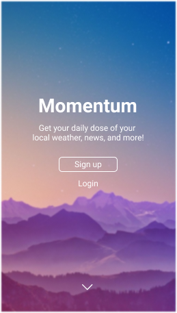
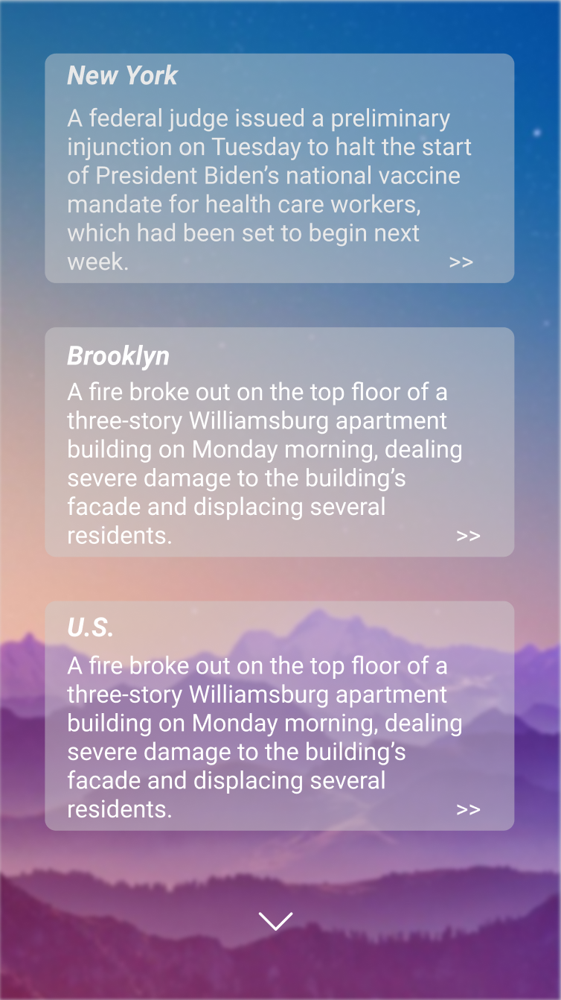
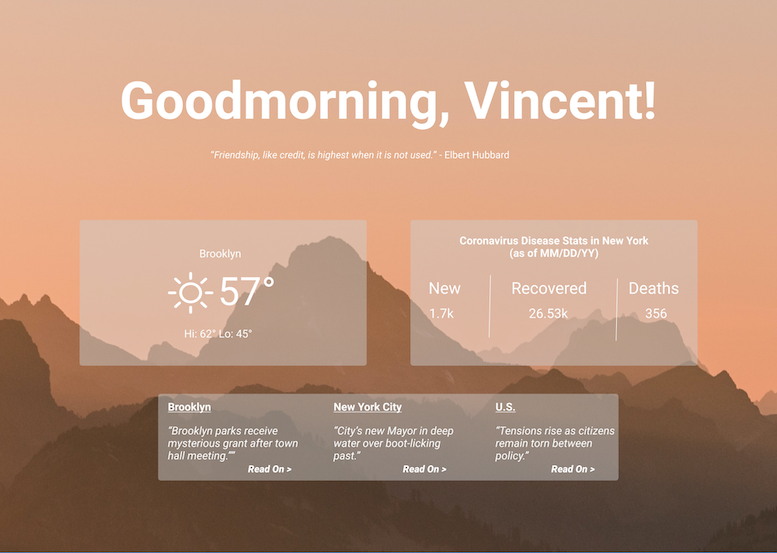

# "Bonjour"
### Table of Contents
- [Description](https://github.com/Mig-uel/Bonjour#description)
- [Wireframes and Mockups](https://github.com/Mig-uel/Bonjour#wireframes--mockups)
- [API Info](https://github.com/Mig-uel/Bonjour#api-info)
- [Dependencies](https://github.com/Mig-uel/Bonjour#dependencies)
- [Contributors](https://github.com/Mig-uel/Bonjour#contributors)

# Description
<em>Bonjour is a homepage-like web app for use throughout your day; especially when getting it started.</em>

🔸Features:
- Provide insight to major news stories local to user
- Display local weather, including chances of rainfall, and air quality
- A new "Quote of The Day" on page for a span of at least 365 days
- Update user on CoViD-19 rates; local and global

🔸Functions:
- Upon and with signup info, user weather data will depend on set location
- With same info, only news stories relevant to location and interests will display
- Each quote of the day will attempt to evoke calmness and readiness for the day ahead
- Information on the current pandemic will be pulled from a trusted API source

🔸Goals:
- Lessen numbers of apps accessed for different updates
- Provide sufficient weather details, so to be checked only once
- Create an almost exclusive news stream based on current locality & preference
- Sufficiently share Coronavirus statistics with changeable metrics

# Wireframes & Mockups
### Mobile View

  
  
  

### Desktop View

# API Info
The four API's used for this project include:
1. [OpenWeather](https://openweather.org/) - for the weather
2. [Quoteable](https://github.com/lukePeavey/quotable) - for the quotes
3. [RapidAPI](https://rapidapi.com/Gramzivi/api/covid-19-data/) - for the Coronavirus disease statistics
4. [NewsAPI](https://newsapi.org/) - for the news feed

# Dependencies
- Axios
- Parcel

# Contributors
- [Jason](https://github.com/Khazinne)
- [Khazinne](https://github.com/himslf)
- [Miguel](https://github.com/mig-uel)

<!-- 🔹How are we meeting the mandatory requirements with this project?
🔹What are additional features or extras we will consider adding on to this project? -->

