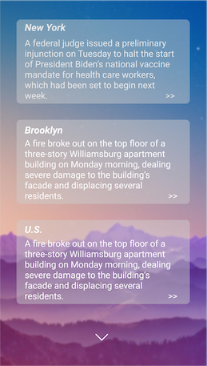

<figure>
  
</figure>

# "Bonjour"
<em>Bonjour is a homepage-like web app for use throughout your day; especially when getting it started.</em>

🔸Features:
<ul>
  <li>Provide insight to major news stories local to user</li>
  <li>Display local weather, including chances of rainfall, and air quality</li>
  <li>A new "Quote of The Day" on page for a span of at least 365 days</li>
  <li>Update user on CoViD-19 rates; local and global</li>
</ul>

🔸Functions:
<ul>
  <li>Upon and with signup info, user weather data will depend on set location</li>
  <li>With same info, only news stories relevant to location and interests will display</li>
  <li>Each quote of the day will attempt to evoke calmness and readiness for the day ahead</li>
  <li>Information on the current pandemic will be pulled from a trusted API source</li>
</ul>

🔸Goals:
<ul>
  <li>Lessen numbers of apps accessed for different updates</li>
  <li>Provide sufficient weather details, so to be checked only once</li>
  <li>Create an almost exclusive news stream based on current locality & preference</li>
  <li>Sufficiently share Coronavirus statistics with changeable metrics</li>
</ul>

# Wireframes & Mockups:
<h4>Mobile View</h4>

  
  
  

# API Info:
The four API's used for this project include:
1. [OpenWeather](https://openweather.org/) - for the weather
2. [Quoteable](https://github.com/lukePeavey/quotable) - for the quotes
3. [RapidAPI](https://rapidapi.com/Gramzivi/api/covid-19-data/) - for the Coronavirus disease statistics
4. [NewsAPI](https://newsapi.org/) - for the news feed

🔹How are we meeting the mandatory requirements with this project?

🔹What are additional features or extras we will consider adding on to this project?

